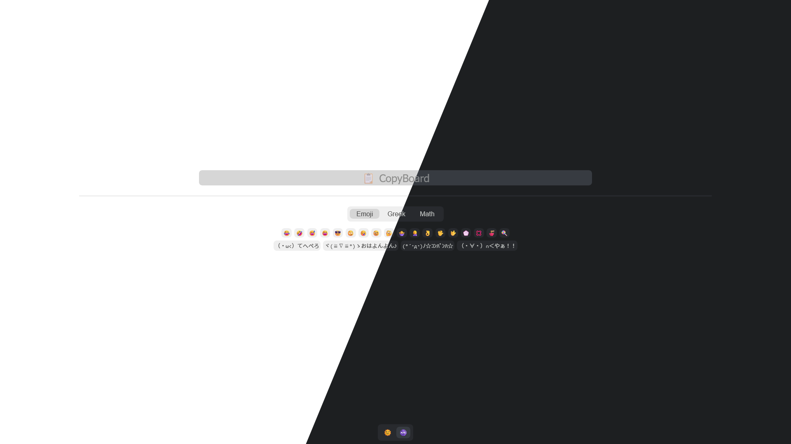

# CopyBoard

Copy Once, Paste Everywhere

[English](README.md) | [正體中文](docs/README.zh_TW.md)



CopyBoard is a simple tool for quickly and easily copying commonly used strings.

There is only one portable file that can work offline, without importing any modules.

- Support tab.
- 🆕 Supports light and dark mode.
- 🆕 Remember color theme and last tab.
- 🆕 Support mobile devices.

## How To Use

1. Click a paging button to switch pages;
2. Click the corresponding button to copy the string on the button to the clipboard.

## Customize

Edit the source code of CopyBoard (open it as a txt file);
Not far from the beginning of the file, edit the variable `buttonMap` according to the format;
Each Array corresponds to a group, and each value is a button;
Save and refresh the webpage.

```javascript
var buttonMap = {
    "Some Tab"： [
        ["Foo", "Bar"],
        ["Bla bla bla..."]
    ], "Another Tab"： [
        ["A Lonely Button"]
    ]  // , ...
}
```

---

Reference:

- Color theme comes from [chriskempson/tomorrow-theme](https://github.com/chriskempson/tomorrow-theme) (MIT)
- A small part of CSS is borrowed from the [teacat/tocas](https://github.com/teacat/tocas) (MIT)
