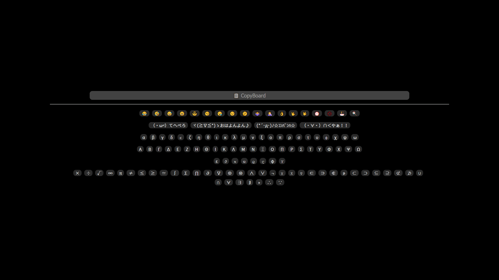

# CopyBoard

Copy Once, Paste Everywhere
一鍵複製，到處貼上



CopyBoard 是一個簡單的 HTML 小工具，用於複製常用字串。

便攜僅一個檔案，可以離線運作，純 HTML/Javascript 無需 Import 其他模組。

There is only one portable file that can work offline, without importing any modules.

## 如何使用 ・ How To Use

點選分頁按鈕切換分頁；
點選對應的按鈕即可複製按鈕上的字串到剪貼簿。

Switch tabs, Then copy the text of the button you clicked.

## 定製你的 CopyBoard ・ Customize

編輯 CopyBoard 的原始碼（以 txt 純文字檔方式開啟）；
在檔案的開頭不遠處，仿照格式編輯變數 `btnMap`；
每個 Array 對應一組，每個 value 是一個按鈕；
儲存後重新整理網頁即可。

Open CopyBoard as the source code,
At the beginning of the code,
Follow the format and edit the variable `btnMap`,
Each array is a button group, and each value is a button,
Save the code and refresh the webpage.

```js
var btnMap = {
    "TabName"： [
        ["foo", "bar"],
        ["Blablabla"]
    ]  // , ...
}
```

---

Reference:

- css-tricks: [Emoji as Favicons](https://css-tricks.com/emojis-as-favicons/)
- stack overflow: [Determine which button was clicked inside a div](https://stackoverflow.com/a/30499537)
